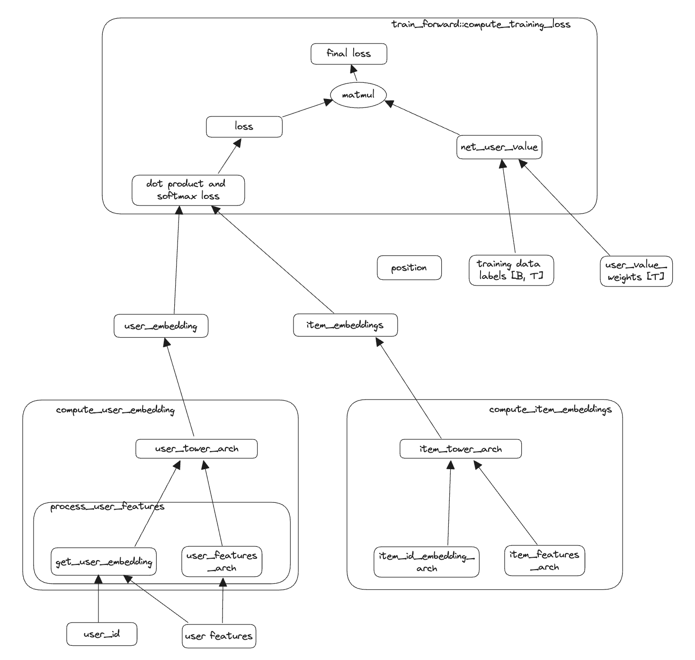
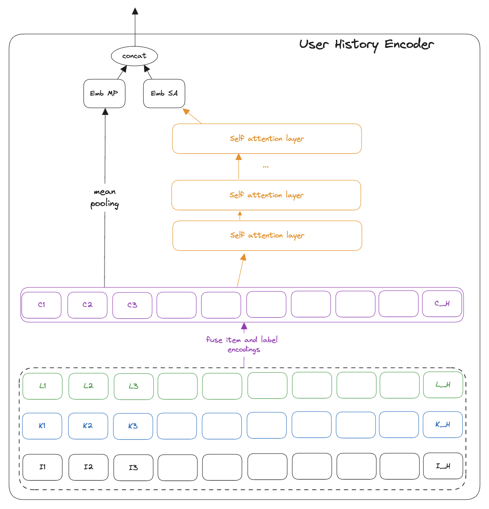
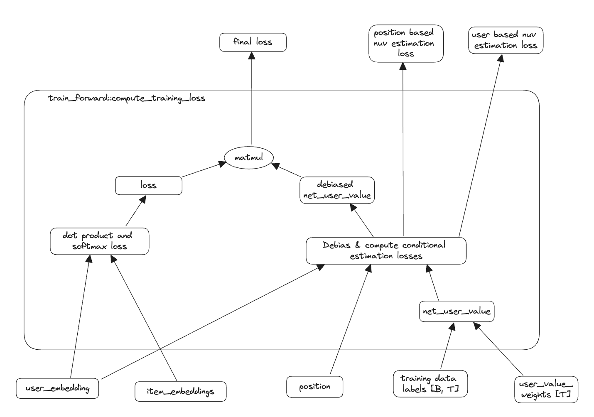

# two_tower_models

This is companion repository to [two tower models](https://recsysml.substack.com/p/two-tower-models-for-retrieval-of), a commonly used approach to retrieval / candidate generation in recommender systems. The goal of this repository is to show how to increase the alignment of retrieval with ranking.

## [two_tower_base_retrieval.py](./src/two_tower_base_retrieval.py)

This shows a sample implementation of two tower models in PyTorch.

### [user_history_encoder.py](./src/user_history_encoder.py)

While the base implementation does a good job of encoding causality based on user features and what is specific to the user's interests, it does not learn what can be inferred from user history. In this file we build a module to encode user history. We encode using both mean-pooling and stacked self attention.
In practise, you might need a preprocessing layer that combines multiple types of interactions, depicted here as the green series "L_{i}" and the blue series "K_{i}".
In the history encoding youy could have a NN module that takes the differnt interactions, presumably each of those being boolean and represented as an action embedding, and the item embedding and emits a combined embedding, depicted as the purple "C_{i}" series. This is what we apply mean-pooling and self attention on top of.

### [two_tower_with_user_history_encoder.py](./src/two_tower_with_user_history_encoder.py)

This uses the UserHistoryEncoder above to add to the user tower.

### [two_tower_with_debiasing.py](./src/two_tower_with_debiasing.py)

Since we are using net user value to estimate the relevance, isolating the part of the user value that is truly impacted by the item by removing the part explained by position and user value helps to get a clean signal.

## [two_tower_plus_light_ranker.py](./src/two_tower_plus_light_ranker.py)

This extends TwoTowerWithPositionDebiasedWeights from above and implements a pointwise ranking module,
broadly described in [Revisting neural accelerators](https://arxiv.org/abs/2306.04039).
We chose this since implementing a light ranking in the retrieval system is an intuitive way to
increase consistency with main ranking.

## [two_tower_plus_light_ranker_plus_main_ranker_kd.py](./src/two_tower_plus_light_ranker_plus_main_ranker_kd.py)

Then we extend this to adding knowledge distillation from ranking models. This is similar 
to the approach described in [How to reduce the cost of ranking by knowledge distillation](https://recsysml.substack.com/p/how-to-reduce-cost-of-ranking-by)

## [two_tower_base_plus_main_ranker_reward_model.py](./src/two_tower_base_plus_main_ranker_reward_model.py)

In this step we add a further layer of funnel consistency where, inspired by
[RLHF](https://arxiv.org/abs/1909.08593), we use the ranking model as a "reward model"
and learn how to make the retrieval more aligned with the ranking model.

## [baseline_mips_module.py](./src/baseline_mips_module.py)

This is a helper file with a matrix multiplication approach to maximum inner product search.
This helps us in having a PyTorch implementation to write tests on.

# References

1. [Seminal paper on two tower models in Youtube](https://static.googleusercontent.com/media/research.google.com/en//pubs/archive/45530.pdf)

------

_Disclaimer:_ These are the personal creations/opinions of the author(s). Any artifacts, opinions stated here are theirs and not representative of their current or prior employer(s). Apart from publicly available information, any other information here is not claimed to refer to any company including ones the author(s) may have worked in or been associated with.
